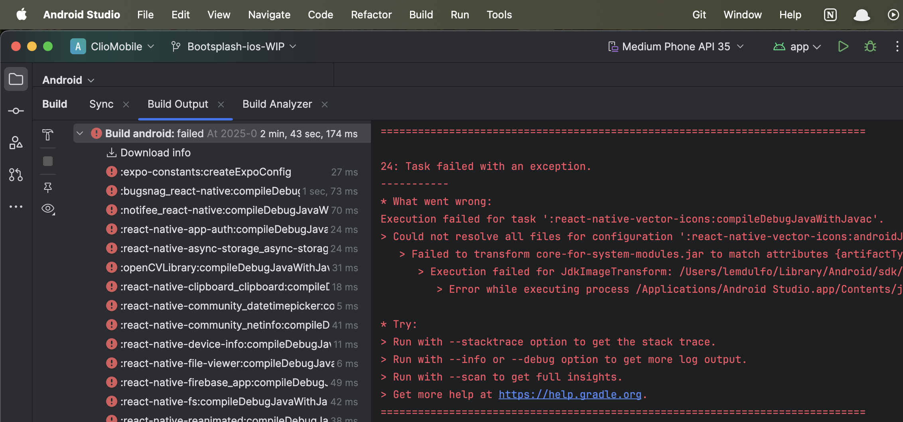
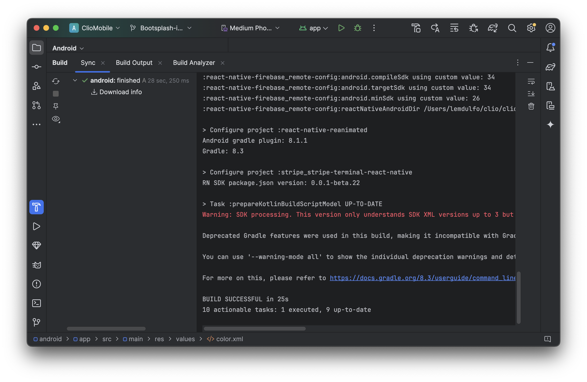

I'm currently primarily working in React Native, and a lot of the time, I use the command line to launch the app, for Android it's `react-native run-android`

Sometimes though, you need to launch the app through Android Studio. For example when you want an easy way to see Logcat logs.

I ran into this issue where the app was building properly through the command line, but failing in Android Studio.

This is odd, because behind the scenes, both the command line and Android Studio use the same tools.

One of the build errors mentioned `react-native-vector-icons`, and I found this issue on their Github: https://github.com/software-mansion/react-native-svg/issues/1723

It mentions `react-native doctor` and JDK 17. The thing is, running this in command line, where the build is already succeeding, will most likely show that you have the correct version of JDK.

Could it be that Android Studio was using a different JDK version? Let's check.

It was using JDK 21 for some reason. I changed it to JDK 17 and the build succeeded.

So there it is, here's some things I learned:

- `react-native doctor` is available, I didn't know about it before
- Android Studio runs a different environment from your command line
- Error messages can sometimes mislead you, treat them as a clue instead of a fact