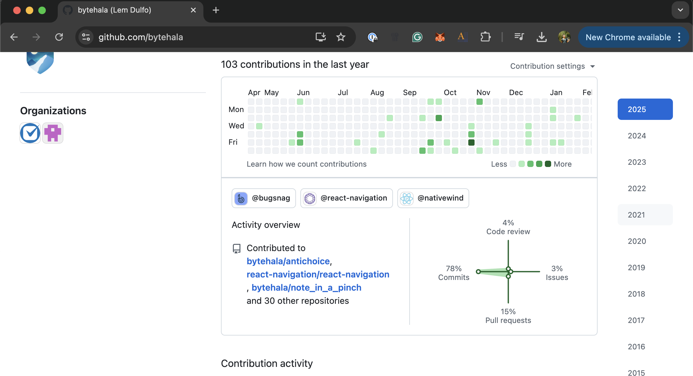
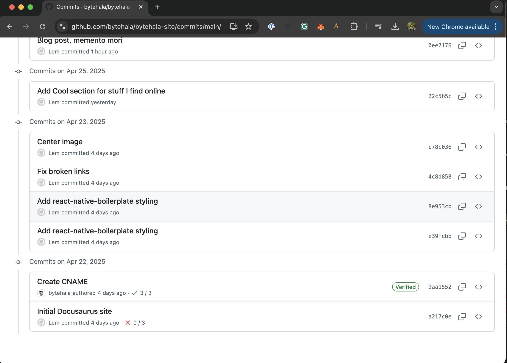
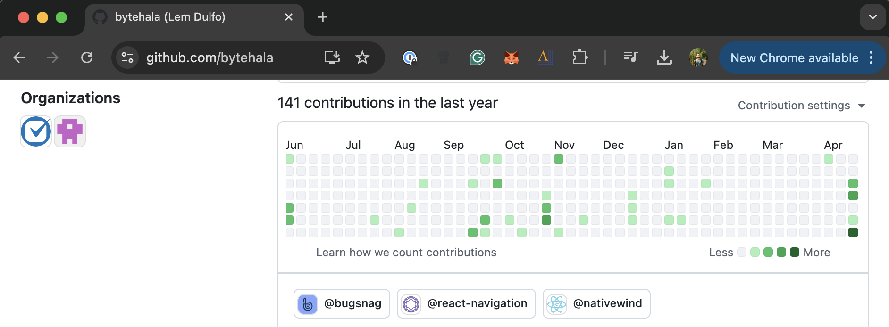

I've been working on my website, and I noticed that my Github heatmap was not updating.
Okay, some devs can pretend that we don't care about the heatmap, but I can't.



I looked commit history, and noticed this weird thing. When I added the CNAME, which is done through GitHub web, it tags the correct author. My other commits, which I did on my laptop, was a different author (still me).



So I went and investigated what my local settings were:

```bash
git config --global user.name
git config --global user.email
git config user.name
git config user.email
```

It was something else, somehow I set my iCloud email, and my first name as the `user.name`.

Git history is basically just a bunch of files, I know it can be edited. Just be warned, it can sometimes make your repo irrecoverable, and even mangle your history. Try not to do this at your job without proper backups, especially since you'll have to force push.

```bash
git filter-branch -f --env-filter '
GIT_COMMITTER_NAME="@bytehala";
GIT_COMMITTER_EMAIL="your-correct-email@example.com";
GIT_AUTHOR_NAME="@bytehala";
GIT_AUTHOR_EMAIL="your-correct-email@example.com";
' --tag-name-filter cat -- --branches --tags
```

You'll see this `WARNING: git-filter-branch has a glut of gotchas generating mangled history rewrites.` I chose to ignore that. heh

After force pushing, here's my new heatmap, showing I made 141 commits so far this 2025:

